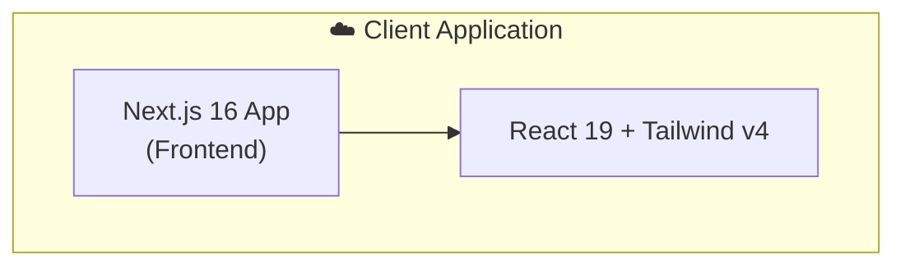

# 🗺️ ComplyMap — Compliance Tracking & Management Platform

<div align="center">

### 🌐 **[Live Demo](#)** &nbsp;|&nbsp; 📦 **[Client Repo](#)** &nbsp;|&nbsp; 🔌 **[Server Repo](#)**

[](https://nextjs.org/)
[](https://react.dev/)
[](https://tailwindcss.com/)

A **production-grade** compliance and task management platform with employee tracking, task management across countries, and a modern, responsive UI.

</div>

---

## 📖 Table of Contents

- [Overview](#-overview)
- [Tech Stack](#-tech-stack)
- [Key Features](#-key-features)
- [Architecture](#-architecture)
- [Getting Started](#-getting-started)
- [Deployment](#-deployment)
- [Author](#-author)

---

## 🎯 Overview

**ComplyMap** is a robust platform designed to simplify compliance tracking, task allocation, and employee management across multiple countries. It provides an intuitive interface for managing compliance tasks, employee details, and country-specific regulations, demonstrating modern web development practices.

### Why This Project Stands Out

- ✅ **Next.js 16 App Router** — Optimized routing and performance
- ✅ **React 19 & React Compiler** — Utilizing the latest React features for seamless UI updates
- ✅ **Tailwind CSS v4** — Utility-first styling for an accessible and responsive design
- ✅ **Theme Support** — Integrated dark/light mode via `next-themes`
- ✅ **Interactive Feedback** — Toast notifications utilizing `react-hot-toast`

---

## 🔧 Tech Stack

### Frontend
| Technology | Purpose |
|------------|---------|
| **Next.js 16** | App Router, React Server Components |
| **React 19** | UI library with modern concurrent features |
| **Tailwind CSS v4** | Utility-first responsive styling |
| **next-themes** | Dark/Light mode theme management |
| **react-hot-toast** | Elegant toast notifications |

---

## ✨ Key Features

### 📋 Task & Employee Management
- Comprehensive views for **Employees**, **Tasks**, and **Countries**.
- Easy-to-use navigation utilizing a responsive Bottom Navigation bar.

### 💅 UI/UX & Performance
- Fully responsive across all devices (Mobile, Tablet, Desktop)
- Seamless theme switching
- Fast performance powered by the React Compiler

---

## 🏗️ Architecture

### System Design



---

## 🚀 Getting Started

### Prerequisites

- **Node.js** v18+ (v22 recommended)

### Quick Start

```bash
# 1. Clone the client repository
git clone https://github.com/ashiqurrhmn/ComplyMap-Client.git
cd ComplyMap-Client

# 2. Install frontend dependencies
npm install

# 3. Start the frontend development server
npm run dev

# Frontend runs on: http://localhost:3000
```

---

## 🌐 Deployment

| Service | Purpose | URL |
|---------|---------|-----|
| **Vercel** | Next.js frontend | *(Coming Soon)* |

---

## 👤 Author

<div align="center">

**Built by [Md. Ashiqur Rahman](https://ashiqur-rahman-portfolio00.netlify.app/)**

[](https://ashiqur-rahman-portfolio00.netlify.app/)
[](https://github.com/ashiqurrhmn)
[](https://www.linkedin.com/in/ashiqur-rahman00/)

</div>

---

<div align="center">

### ⭐ Found this helpful? Give it a star!

**Built with ❤️ using Next.js and React**

</div>
